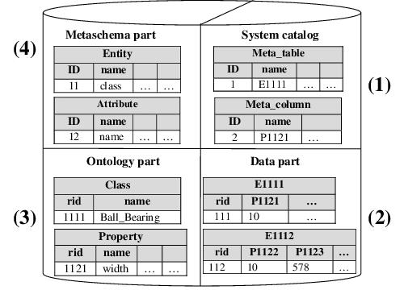

# OntoDB

OntoDB is an ontology based database tool, support of multiple ontology models within ontology based database.

## Related tools and libraries

Several tools and libraries have been developped around the OntoDB ontology based database tool. Two versions of these libraries and tools are available : version 1 (historic version) and version 2 (optimized and refactored version).

* OntoDB schema ([version 1](https://github.com/lias-laboratory/ontodbschema_v1), [version 2](https://github.com/lias-laboratory/ontodbschema_v2)): an ontology based database tool, support of multiple ontology models within ontology based database
* OntoQL ([version 1](https://github.com/lias-laboratory/ontoql_v1), [version 2](https://github.com/lias-laboratory/ontoql_v2)): is an exploitation language for ontology based databases (OBDB).
* OntoQLPlus ([version 1](https://github.com/lias-laboratory/ontoqlplus_v1), [version 2](https://github.com/lias-laboratory/ontoqlplus_v2)): is an OntoQL editor.
* OntoQLConsole (only for [version 1](https://github.com/lias-laboratory/ontoqlconsole_v1)): is an OntoQL interactive terminal.
* BeMoRe (only for [version 1](https://github.com/lias-laboratory/bemore)): Behaviour Model Repository, an extending Persistent Meta-Modeling Systems with Behavioral Semantics.

## Overview

This section presents an historic review of OntoDB ontology based database tool.

### PLIB

In the 90s, to allow the exchange of electronic catalogues of industrial components, an ontology model for technical domain was developed and then published as an international standard known as PLIB (ISO 13584-42: 98). Then, a model to exchange objects described in terms of such ontologies was developed and also standardized (ISO 13584-25:2003). In the beginning of 2001, the PLIB model being finished, a new project called OntoDB was launched. It aimed to store, exchange, integrate and process industrial catalogues modeled as ontology-based data associated with a formal ontology. PLIB-based ontologies were first targeted. Then, the decision to also to support other ontology models such that OWL or DAML+OIL has been taken. We outline below both the PLIB ontology model and the model for PLIB-based instance data.

#### PLIB Ontology Model

The PLIB ontology model is technical domain-oriented as it supports four main capabilities broadly used in engineering: (1) a property value may depend upon its evaluation context (e.g., the length of an axis depends upon its temperature), thus a property may be a function, (2) the property value may be associated with a measure unit (e.g., a temperature may be expressed in degree Celsius), (3) an object must be characterized by one single "characterization class" (associated with properties), but it may also be associated with any number of discipline-specific ontology class, the point of view itself being represented by an ontology class [13], and (4) an object may be classified in any number of "classification class" (not associated with properties). It is worth noticing that this particular taxonomy of meta classes allows PLIB ontology to represent a number of Semantic Web applications such as Web Portal catalogs.

PLIB ontologies are domain ontologies: they describe by means of classes and properties all the consensual entities of the target domain. Each property is defined in the context of a class, that constitutes its domain, and it has a meaning only for this class and its possible subclass(es). To avoid the contextual character of a classification, in a PLIB ontology, a class is created only if it is necessary to define the domain of a property that would not be understood in the context of its super-class. Inversely, a property can be defined in the context of a class even if it does not apply to all its instances or subclasses. The single condition is that it is defined in an unambiguous way.

Thus, class hierarchies of PLIB ontology are extremely ”flat”. They do not define all the possible classes existing in a given domain, but they define only a canonical minimal vocabulary that consists only of primitive concepts. This vocabulary shall only make it possible to describe, in a single way by a class belonging and a set of properties value pairs, all instances which are subject of a common understanding by domain experts. Any entity existing in a domain can thus be described, either directly in terms of the shared ontology or by adding additional classes that refine shared concepts and/or that add properties to the shared ontology.

#### PLIB Instance Data Model

Contrary to individuals of description logic-based ontologies that may belong to any number of non connected ontology classes, the PLIB instance model is strongly typed. This means that (1) each instance belongs to exactly one minimal characterization class (called its basis class which is the minimum for subsumption order of all the characterization classes to which the instance belongs), (2) each property is defined in the context of a characterization class that defines its domain of application, and is associated with a range and (3) only properties that are applicable in the context a characterization class may be used for describing its instance.

### OntoDB

OntoDB is implemented on top of the PostgreSQL DB-MS. It has a four-parts architecture depicted in the next figure.

* The system catalog (1) is a traditional part of any DBMS. It contains system tables used to manage all the data contained in the database. In OntoDB, it contains specically the description of all the tables and columns dened in the three other parts of this architecture.

* The data part (2) stores the ontology instances. An instance belongs to an ontology class and is described by a set of property values.

* The ontology part (3) stores the ontologies which dene the concepts of the domain covered by the database. OntoDB initially supports the PLIB ontology language.

* The metaschema part (4) stores the ontology language used. For the ontology part, the metaschema part plays the same role as the one played by the system catalog in traditional DBMSs. It can be in particular used to extend the ontology part and thus to modify the used ontology language.

More information can be found into the OntoDBSchema repository.

### OntoQL

The OntoQL language provides access to (1) ontology instances through its Data Denition, Manipulation, and Query Languages, (2) ontologies through its Ontology Denition, Manipulation, and Query Languages and both ontologies and their instances.

More information can be found into the OntoQL language repository.

### Involved Research Projects

#### DaFOE4App

The DaFOE4App (Differential and Formal Ontology Editor For Applications) technical platform is a set of tools including an ontology editor that considers the whole issue of the semantics of those ontologies, through epistemological issues related to high level formal concepts in relation to a domain point of view, and through works on textual corpuses.

Thus, it provides a formalized ontology that can be processed in any ontology editors compliant with the W3C ontology standard languages (OWL).

Start period: January 2007
Duration: 36 months

#### e-Wok HUB

The e-WOK Hub project aims at developing a set of communicating portals (called hubs), offering both: (a) web applications accessible to end-users through online interfaces, and (b) web services accessible to applications through programmatic interfaces. The e-WOK_HUB system relies on such a service-oriented architecture (SOA) where business applications are built on service composition and orchestration and where a hub can be considered as a warehouse of semantic business resources.

Start Period: 2006, June
Duration: 36 months
Type: RNTL
Project website: http://www-sop.inria.fr/edelweiss/projects/ewok/

## Publications

This section lists all scientific papers related to the OntoDB ontology based database tool.

### Books

* Yamine AIT-AMEUR, Mickael BARON, Nabil BELAID, Stéphane JEAN, Laura Mastella, Ontology Integration and Management within Data Intensive Engineering Systems, In Shared Earth Modeling: Knowledge Driven Solutions for Building and Managing Subsurface 3D Geological models (Shared Earth Modeling), chapt. 13, 2013, pp. 281-305

* Stéphane JEAN, Yamine AIT-AMEUR, Guy PIERRA, Ontology Query Languages for Ontology-Based Databases: a Survey, Ontology Query Languages for Ontology-Based Databases: a Survey, 2009

* Stéphane JEAN, Guy PIERRA, Yamine AIT-AMEUR, Domain Ontologies: a Database-Oriented Analysis, Domain Ontologies: a Database-Oriented Analysis, 1, Lecture Notes in Business Information Processing, August, 2007

### Journals

* Yamine Ait-Ameur, Mickael Baron, Ladjel Bellatreche, Stéphane Jean, Eric Sardet, Ontologies in engineering: The OntoDB/OntoQL platform, Soft Computing, 2015

* Nabil BELAID, Stéphane JEAN, Yamine AIT-AMEUR, Jean-François Rainaud, An Ontology and Indexation Based Management of Services and Workflows: Application to Geological Modeling, International Journal of Electronic Business Management (IJEBM 2011), vol. 9, n. 4, 2011, pp. 296-309

* Ladjel Bellatreche, Yamine Aït-Ameur and Guy Pierra, Guest editorial: Special issue on Contribution of Ontologies in Advanced Information Systems, Data & Knowledge Engineering (DKE), Peter Chen, 2010

* Ladjel Bellatreche, Yamine Aït-Ameur and Chedlia Chakroun, A design methodology of ontology based database applications, Logic Journal of the IGPL - Oxford University Press, 2010

* Stéphane Jean, Yamine Aït-Ameur and Guy Pierra, Ontology Query Languages for Ontology-Based Databases: a Survey, Data Warehousing Design and Advanced Engineering Applications: Methods for Complex Construction, Advances in Data Warehousing and Mining Book Series (ADWN), L. Bellatreche, 2009

* Ladjel Bellatreche, Dung Nguyen Xuan, Guy Pierra and Hondjack Dehainsala, Contribution of Ontology-based Data Modeling to Automatic Integration of Electronic Catalogues within Engineering Databases, Computers in Industry Journal 57 (8-9), pp. 711-724, 2006 ([link](https://www.lias-lab.fr/publications/7303/2006-CIJ-Bellatreche.pdf))

* Guy Pierra, Hondjack Dehainsala, Yamine Aït-Ameur and Ladjel Bellatreche, Base de données à base ontologique : principe et mise en œuvre, Ingénierie des systèmes d'information, 2005 ([link](https://www.lias-lab.fr/publications/7198/2005-I-Pierra.pdf))

### Conferences

* Kevin ROYER, Ladjel BELLATRECHE, Stéphane JEAN, One Semantic Data Warehouse Fits both Electrical Vehicle Data and their Business Processes, Proceedings of the 17th International IEEE Conference on Intelligent Transportation Systems (ITSC 2014), 2014

* Kevin ROYER, Ladjel BELLATRECHE, Stéphane JEAN, Combining domain and business ontologies in a modular construction method: EDF study case, Proceedings of the 38th International Convention, MiproBIS - Business Intelligence Systems (MIPRO 2014), 2014

* Youness BAZHAR, Yassine OUHAMMOU, Yamine AIT-AMEUR, Emmanuel GROLLEAU, Stéphane JEAN, Persistent Meta-Modeling Systems as Heterogeneous Model Repositories, International Conference on Model and Data Engineering (MEDI 2013), edited by Springer LNCS, 2013

* Chedlia CHAKROUN, Ladjel BELLATRECHE, Yamine AIT-AMEUR, Nabila Berkani, Stéphane JEAN, Be Careful When Designing Semantic Databases: Data and Concepts Redundancy, The Seventh IEEE International Conference on Research Challenges in Information Science. (RCIS 2013), 2013

* Youness BAZHAR, Yamine AIT-AMEUR, Stéphane JEAN, BeMoRe: a Repository for Handling Models Behaviors, 25th International Conference on Software Engineering and Knowledge Engineering (SEKE 2013), 2013

* Youness BAZHAR, Chedlia CHAKROUN, Yamine AIT-AMEUR, Ladjel BELLATRECHE, Stéphane JEAN, Extending Ontology-Based Databases with Behavioral Semantics, Ontologies, DataBases, and Applications of Semantics (ODBASE), Rome, Italy, September, 2012, pp. 879-896

* Youness BAZHAR, Yamine AIT-AMEUR, Stéphane JEAN, Mickael BARON, A Flexible Support of Non Canonical Concepts In Ontology-Based Databases, Proceedings of the 8th International Conference on Web Information Systems and Technologies (WEBIST), Porto, Portugal, April, 2012, pp. 393-398

* Nabil BELAID, Yamine AIT-AMEUR, Stéphane JEAN and Jean-François RAINAUD, TOWARD A SEMANTIC MANAGEMENT OF GEOLOGICAL MODELINGWORKFLOWS, International Conference on Knowledge Engineering and Ontology Development (KEOD'10), 2010

* Stéphane Jean, Yamine Aït-Ameur and Guy Pierra, A Language for Ontology-Based Metamodeling Systems, 14th East-European on Advances In Databases and Information Systems (ADBIS 2010), LNCS 6295, edited by Springer, September, 2010, pp. 247-261

* Henry Valéry Téguiak, Yamine Aït-Ameur, Stéphane Jean and Eric Sardet, Incremental design of ontologies: A model transformation-based approach, International Conference on Knowledge Engineering and Ontology Development (KEOD)(ISBN 978-989-8425-29-4), edited by Joaquim Filipe and Jan L.G. Dietz, Valencia, Spain, October, 2010, pp. 94 - 103

* Chimène Fankam, Stéphane Jean, Guy Pierra, Ladjel Bellatreche and Yamine Ait-Ameur, Towards Connecting Database Applications to Ontologies, First International Conference on Advances in Databases, Knowledge, and Data Applications, edited by IEEE Computer Society, Conference Publishing Service, 2009, pp. 131-137 Open file ([link](https://www.lias-lab.fr/publications/8544/2009-FICADKDA-Fankam.pdf))

* Nabil BELAID, Yamine AIT-AMEUR and Jean-François RAINAUD, A Semantic Repository for Geological Modeling Workflows, ICWS'09, IEEE International Conference on Web Services, ICWS 2009, Los Angeles, CA, USA, 6-10 July 2009, IEEE, 2009, pp. 1030-1031

* Nabil BELAID, Yamine AIT-AMEUR and Jean-François RAINAUD, A semantic handling of geological modeling workflows, MEDES '09: International ACM Conference on Management of Emergent Digital EcoSystems, Lyon, France, October 27-30, 2009, 978-1-60558-829-2, ACM, 2009, pp. 83-90

* Laura Silveira Mastella, Yamine Ait-Ameur, Stéphane Jean, Michel Perrin and Jean-François Rainaud, Semantic exploitation of persistent metadata in engineering models: application to geological models, IEEE International Conference on Research Challenges in Information Science (RCIS 2009), edited by André Flory, Martine Collard, April, 2009, pp. 147-156

* Laura Silveira Mastella, Yamine Ait-Ameur, Stéphane Jean, Michel Perrin and Jean-François Rainaud, Semantic Exploitation of Engineering Models: an Application to Oilfield Models , Proceedings of the 6th British National Conference on Databases (BNCOD 2009), LNCS, July , 2009 

* Dilek Tapucu, Gayo Diallo, Stéphane Jean, Yamine Aït-Ameur, Murat Osman Ünalir and Nacima Belaidi, Définition et Exploitation des Préférences au Niveau Sémantique, Journées Francophones sur les Ontologies (JFO 2009), ACM, 2009, pp. 29-36 

* Dilek Tapucu, Stephane Jean, Yamine Aït-Ameur and Murat Osman Ünalir, An Extension of Ontology Based Databases to Handle Preferences, 11th International Conference on Enterprise Information Systems (ICEIS 2009), May, 2009, pp. 208-214

* Nabil BELAID, Yamine AIT-AMEUR and Jean-François RAINAUD, SWAPT - Semantic Workflow Architecture for Petroleum Techniques, WEBIST 2009 - Proceedings of the Fifth International Conference on Web Information Systems and Technologies, Lisbon, Portugal, March 23-26, 2009, 978-989-8111-81-4, INSTICC Press, 2009, pp. 101-104

* Yamine Aït-Ameur, Nabil Belaid, Mohammed Bennis, Olivier Corby, Rose Dieng-Kuntz, Jérémie Doucy, Priscille Durville, Chimène Fankam, Fabien L. Gandon, Alain Giboin, Patrick Giroux, Sandrine Grataloup, Bruno Grilheres, Florian Husson, Stéphane Jean, Joel Langlois, Phuc-Hiep Luong, Laura Silveira Mastella, Olivier Morel, Michel Perrin, Guy Pierra, Jean-François Rainaud, Idir Aït-Sadoune, Eric Sardet, Francois Tertre and João Francisco Valiati, Semantic Hubs for Geological Projects, Workshop on Semantic Metadata Management and Applications (SeMMA 2008), June, 2008, pp. 3-17

* Nabil Belaid, Idir Aït-Sadoune, Yamine Aït-Ameur, Jean-François Rainaud and Stéphane Jean, Une architecture orientée services pour la gestion sémantique des données géologiques pour le stockage de CO2, Actes de l’atelier Systèmes d’Information et de Décision pour l’Environnement du Congrès INFORSID 2008, 2008, pp. 67-76

* Nabil Belaid, Ladjel Bellatreche, Yamine Ait-Ameur and Guy Pierra, Intégration de sources à base ontologique : architecture en réseau VS architure en étoile, Plate-Forme AFIA: Atelier Thématique GDR I3 sur Ontologies et Gestion de l'hétérogénéité sémantique (OGHS), Juillet, 2007, pp. 9-20

* Nabil Belaid, Idir Aït-Sadoune, Yamine Aït-Ameur, Jean-François Rainaud and Stéphane Jean, Une architecture orientée services pour la gestion sémantique des données géologiques pour le stockage de CO2, Actes de l’atelier Systèmes d’Information et de Décision pour l’Environnement du Congrès INFORSID 2008, 2008, pp. 67-76

* Chimène Fankam, Stéphane Jean, Ladjel Bellatreche and Yamine Aït-Ameur, Extending the ANSI/SPARC Architecture Database with Explicit Data Semantics: An Ontology-Based Approach, Second European Conference on Software Architecture(ECSA), edited by LNCS Springer, September, 2008, pp. 318-321

* Chimène Fankam, Stéphane Jean, Guy Pierra and Ladjel Bellatreche, Enrichissement de l'architecture ANSI/SPARC pour expliciter la sémantique des données : une approche fondée sur les ontologies, Actes de la 2ème Conférence francophone sur les Architectures Logicielles (CAL'08), edited by Revue RNTI, mars, 2008, pp. 47-61 ([link](https://www.lias-lab.fr/publications/8005/2008-ACAL-Fankam.pdf))

* Stéphane Jean, Yamine Aït-Ameur and Guy Pierra, Une approche langage pour la gestion de données dans les systèmes de méta-modélisation, INFORSID 2007, Mai, 2007 ([link](https://www.lias-lab.fr/publications/7757/2007-INFORSID-Jean.pdf))

* Stéphane Jean, Yamine Ait-Ameur and Guy Pierra, An Object-Oriented Based Algebra for Ontologies and their Instances, Advances in Databases and Information Systems (ADBIS'07), vol. 4690/2007, Lecture Notes in Computer Science, edited by Springer Berlin / Heidelberg, 2007, pp. 141-156 ([link](https://www.lias-lab.fr/publications/7846/2007-ADIS-Jean.pdf))

* Stéphane Jean, Hondjack Dehainsala, Dung Nguyen Xuan, Guy Pierra, Ladjel Bellatreche and Yamine Aït-Ameur, OntoDB: It is Time to Embed your Domain Ontology in your Database, Database Systems for Advanced Applications (DASFAA'07) (Demo Paper), LNCS, 2007, pp. 1119-1122  ([link](https://www.lias-lab.fr/publications/7728/2007-DSAAP-Jean.pdf))

* Guy Pierra, Yamine Aït-Ameur, Ladjel Bellatreche, Hondjack Dehainsala, Stéphane Jean, Chimène Fankam and Dung Nguyen Xuan, Données à base ontologique: gestion, interrogation, intégration, Première édition des Journées Francophones sur les Ontologies (JFO 2007), Octobre, 2007

* Stéphane Jean, Yamine Aït-Ameur and Guy Pierra, Querying ontology based databases. The OntoQL proposal, Software Engineering and Knowledge Engineering (SEKE2006), Knowledge Systems Institute Graduate School, Juillet, 2006, pp. 166-171 ([link](https://www.lias-lab.fr/publications/7423/2006-SEKE-Jean.pdf))

* Stéphane Jean, Yamine Aït-Ameur and Guy Pierra, Querying Ontology Based Databases Using OntoQL (an Ontology Query Language), Ontologies, DataBases, and Applications of Semantics (ODBASE'2006), vol. 4275, Lecture Notes in Computer Science, edited by R.Meersman, Z. Tari et al., Springer, 2006, pp. 704-721 ([link](https://www.lias-lab.fr/publications/7734/2006-ODAS-Jean.pdf))

* Stéphane Jean, Guy Pierra and Yamine Ait-Ameur, OntoQL: an exploitation language for OBDBs, VLDB PhD Workshop, 29 Août, 2005 ([link](https://www.lias-lab.fr/publications/7282/2005-VLDB-Jean.pdf))

### Thesis and HDR

* Youness BAZHAR, Handling Behavioral Semantics in Persistent Meta-Modeling Systems, Thesis, ISAE-ENSMA, december, 2013

* Chedlia CHAKROUN, Contribution à la définition d’une méthode de conception de bases de données à base ontologique, Thesis, ISAE-ENSMA, october, 2013

* Nabil BELAID, Modélisation de services et de workflows sémantiques à base d'ontologies de services et d’indexations. Application à la modélisation géologique., Thesis, ISAE / ENSMA, may, 2011

* Dilek TAPUCU, A generic model for handling preferences in Ontology Based Databases, Thesis, LISI / ENSMA, july, 2010

* Stéphane Jean, OntoQL, un langage d’exploitation des bases de données à base ontologique, Thesis, Sciences pour l'Ingénieur et Aéronautique, Décembre, 2007 ([link](https://tel.archives-ouvertes.fr/docs/00/20/17/77/PDF/these-stephane-jean.pdf))

* Hondjack Dehainsala, Explicitation de la sémantique dans les base de données : Base de données à base ontologique et le modèle OntoDB, Thesis, LISI/ENSMA et Université de Poitiers, Mai, 2007 ([link](https://tel.archives-ouvertes.fr/docs/00/15/75/95/PDF/These.pdf))

* Chimène Fankam, OntoDB2 : un système flexible et efficient de Base de Données à Base Ontologique pour le Web sémantique et les données techniques, Thesis, ENSMA, Decembre, 2009 ([link](https://www.lisi.ensma.fr/ftp/pub/documents/thesis/2009-thesis-fankam.pdf))

* Intégration de bases de données hétérogènes par articulation à priori d'ontologies: application aux catalogues de composants industriels, Thesis, Sciences pour l'Ingénieur et Aéronautique, Décembre, 2006 ([link](https://tel.archives-ouvertes.fr/docs/00/25/20/99/PDF/These_dung_xuan_nguyen.pdf))

* Ladjel Bellatreche, Contributions à la Conception et l’Exploitation des Systèmes d’Intégration de Données, Thesis, Habilitation à diriger les recherches, ENSMA, Novembre, 2009

### Research Projects Reports

* Yamine Ait-Ameur, Idir Ait-Sadoune, Mickael Baron, Chimène Fankam, Stéphane Jean, Guy Pierra and Eric Sardet, Rapport Evaluation - Lot 1 (Tache 1.3) - Projet E-Wok-Hub, LISI / ENSMA, 2009

* Yamine Ait-Ameur, Hondjack Dehainsala, Stéphane Jean, Guy Pierra and Eric Sardet, Persistance des données ontologiques avec OntoDB et langage d'exploitation OntoQL - Lot 3 - Projet E-Wok-Hub, LISI / ENSMA, 2007

* Yamine Ait-Ameur, Chimène Fankam, Stéphane Jean, Guy Pierra and Eric Sardet, Outils et Services de gestion des Ontologies - Lot 2 - Projet ANR E-Wok-Hub, LISI / ENSMA, 2007

## Software licence agreement

Details the license agreement of PARAD: [LICENCE](LICENCE)

## Historic Contributors

* [Yamine AIT-AMEUR](https://www.lias-lab.fr/members/yamineaitameur/)
* [Mickael BARON](https://www.lias-lab.fr/members/mickaelbaron/)
* [Youness BAZHAR](https://www.lias-lab.fr/members/younessbazhar/)
* [Ladjel BELLATRECHE](https://www.lias-lab.fr/members/bellatreche/)
* [Nabil BELAID](https://www.lias-lab.fr/members/nabilbelaid/)
* [Chedlia CHAKROUN](https://www.lias-lab.fr/members/chedliachakroun/)
* [Hondjack DEHAINSALA](https://www.lias-lab.fr/members/hondjackdehainsala/)
* [Chimène FANJAM](https://www.lias-lab.fr/members/chimenefankam/)
* [Stéphane JEAN](https://www.lias-lab.fr/members/stephanejean/)
* Laura MASTELLA
* [Dung NGUYEN XUAN](https://www.lias-lab.fr/members/dungnguyenxuan/)
* [Guy PIERRA](https://www.lias-lab.fr/members/guypierra/)
* [Kevin ROYER](https://www.lias-lab.fr/members/kevinroyer/)
* [Eric SARDET](https://www.lias-lab.fr/members/ericsardet/)
* [Dilek TAPUCU](https://www.lias-lab.fr/fr/members/dilektapucu/)